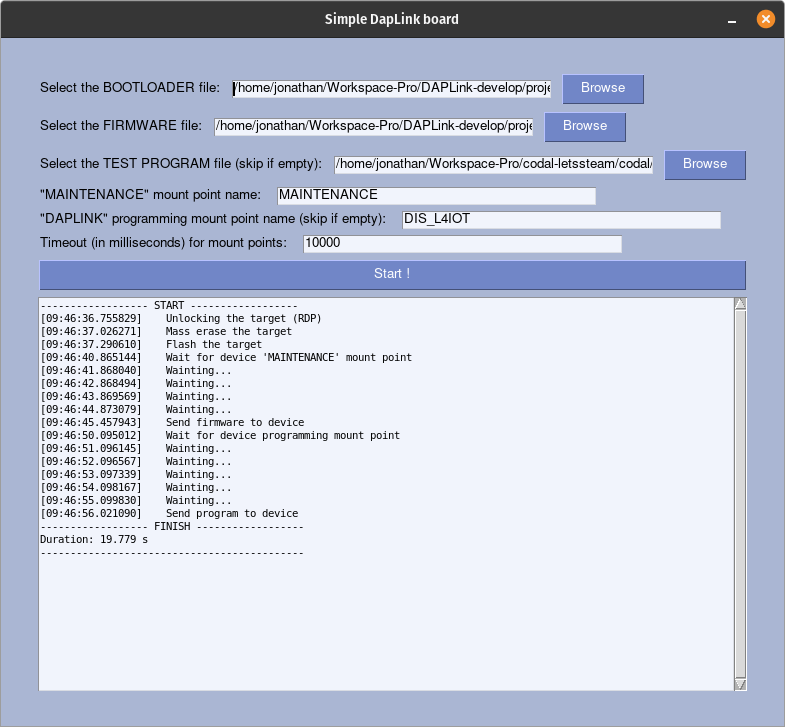

# Simple DAPLink tool

This tools is for internal usage, we use it to load daplink on target (STM32L475, STM32WB55, ...), to replace ST-LINK.

_This is beautiful, isn't it?_

## Requirements

### :computer: System
  - [OpenOCD](https://openocd.org/): `sudo apt install openocd`
  - Python3: `sudo apt install python3`
  - Python3-pip: `sudo apt install python3-pip`
  - python3-tk: `sudo apt install python3-tk`

:bulb: All in one: `sudo apt install openocd python3 python3-pip python3-tk` 

### :snake: Python
  - [virtual-env](https://docs.python-guide.org/dev/virtualenvs/#lower-level-virtualenv): `pip install virtualenv` _(optionnal)_
  - [PySimpleGUI](https://pysimplegui.readthedocs.io/en/latest/): `pip install pysimplegui`
  - [psutil](https://psutil.readthedocs.io/en/latest/): `pip install psutil`

:bulb: You can install everything (virtual env include), with the `install.sh` script.

## Usage

The program offer a simple GUI. to select the bin that will be flashed on the STM32F1x, and automatically apply the process.

  1. Launch the script `easy_daplink.py` file (e.g `python3 easy_daplink.py`)  
      If you are using a virtual env, you can start the program with `start_venv.sh`
  2. Select the files
     1. Select the bootloader binary file to flash (e.g: `stm32f103xb_bl.bin`)
     2. Select the firmware binary file to flash (e.g: `stm32f103xb_stm32l475vg_if.bin`)
     3. Select the program binary file to flash _(optionnal)_
  3. Set the mount point name
     1. For "Maintenance", after bootloader was flashed (e.g: `MAINTENANCE`)
     2. For "Programming", after firmware was flashed (e.g: `DIS_L4IOT`, `DAPLINK`, ...)
  4. Define the timeout mount point waiting (e.g: `10000`), in milliseconds (1000 milliseconds = 1 second)
  5. Push the "Start" button.

:bulb: Pro tips: All inputs are saved for the next time you will open the tool !

## Process
  * Unlock the RDP of the STM32F1x (if needed)
  * Mass erase flash
  * Write bootloader
  * Write firmware
  * Write test program _(optionnal)_
