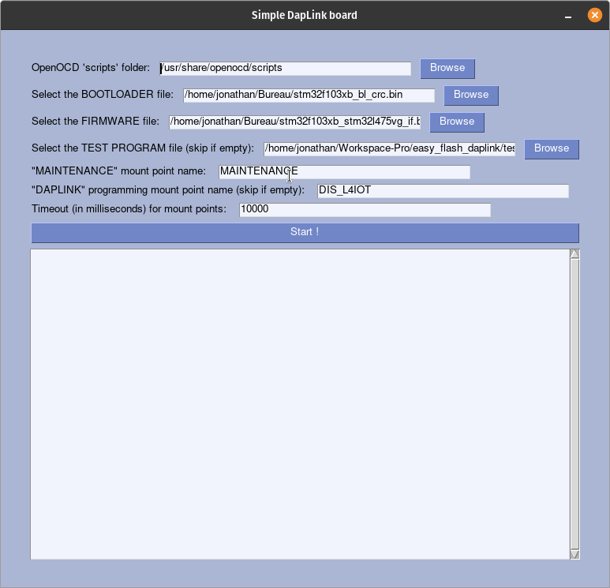
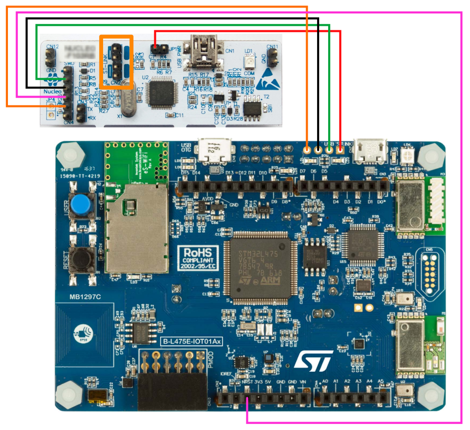
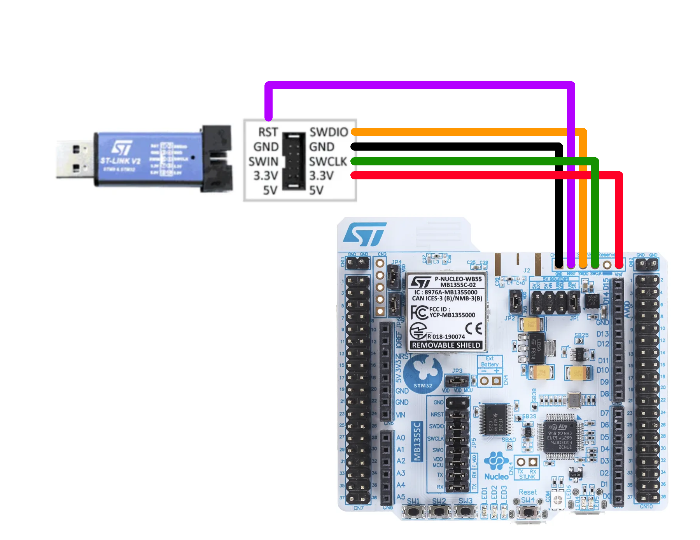
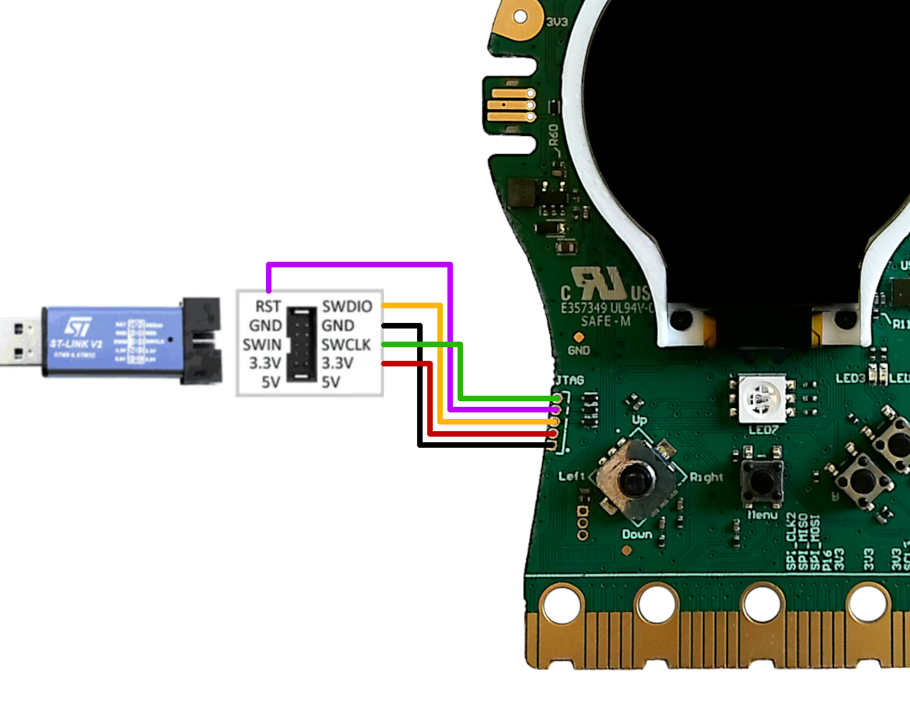
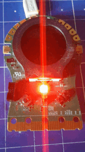

# DapLink - EasyFlash

[English](README.md) - Français

- [DapLink - EasyFlash](#daplink---easyflash)
  - [Introduction](#introduction)
  - [Dépendances](#dépendances)
    - [:computer: Système](#computer-système)
    - [:floppy\_disk: Bootloader \& Firmware](#floppy_disk-bootloader--firmware)
  - [Utilisation](#utilisation)
    - [:electric\_plug: Hardware](#electric_plug-hardware)
      - [STM32 Disco L475 IoTNode](#stm32-disco-l475-iotnode)
        - [STLink V2 (ou clones)](#stlink-v2-ou-clones)
        - [Black Magic Probe (V2.1)](#black-magic-probe-v21)
        - [STLink Nucleo](#stlink-nucleo)
      - [STM32 Nucleo WB55](#stm32-nucleo-wb55)
      - [STeaMi](#steami)
    - [:computer: Software](#computer-software)
    - [:crab: Éxécuter à partir des sources](#crab-éxécuter-à-partir-des-sources)
  - [Test files](#test-files)
    - [`test-l475.bin`](#test-l475bin)
    - [`test-wb55.bin`](#test-wb55bin)

## Introduction
Cet outil est à usage interne, nous l'utilisons pour charger daplink sur certaine target (STM32L475, STM32WB55, ...), en remplacement de ST-LINK.

A l'aide d'OpenOCD, le programme effectue les opérations suivantes :
  1. Dévérouillage du RDP sur STM32F103xB
  2. Effecement total de la flash
  3. Ecriture du bootloader
  4. Tranfert du firmware
  5. _(optionnel)_ Transfert du programme de test 

_L'apparance peut varier suivant la configuration de l'OS_

## Dépendances
### :computer: Système
To avoid installing OpenOCD on your computer, we recommend using the pre-built version maintained by [XPack](https://github.com/xpack-dev-tools/openocd-xpack/releases/tag/v0.12.0-4). The tested and compatible version is `v0.12.0-4`.

Once you've downloaded and decompressed the archive corresponding to your OS, move the files/folders as follows (the term _root folder_ refers to the folder where the `easy-flash-daplink-[version]-[os]` executable is located):
 - **All files** in the `bin` folder must be moved to the root folder.
 - The `scripts` folder in the `openocd` folder must be moved to the root folder
  
:bulb: The archives available in [releases](https://github.com/letssteam/DapLink-EasyFlash/releases) already contains all the files placed where they need to be.

:warning: **Mac OS X** n'est pas supporter, mais nous ouvert aux contributions :wink:

### :floppy_disk: Bootloader & Firmware
- Bootloader
  - STM32F103xB: [https://github.com/letssteam/DAPLink/releases/latest/download/stm32f103xb_bl.bin](https://github.com/letssteam/DAPLink/releases/latest/download/stm32f103xb_bl.bin)

- Firmware
  - STM32L475VG: [https://github.com/letssteam/DAPLink/releases/latest/download/stm32f103xb_stm32l475vg_if.bin
](https://github.com/letssteam/DAPLink/releases/latest/download/stm32f103xb_stm32l475vg_if.bin
)  
  - STM32WB55RG: [https://github.com/letssteam/DAPLink/releases/latest/download/stm32f103xb_stm32wb55rg_if.bin
](https://github.com/letssteam/DAPLink/releases/latest/download/stm32f103xb_stm32wb55rg_if.bin
)  
  - STeaMi: [https://github.com/letssteam/DAPLink/releases/latest/download/stm32f103xb_steami32_if.bin
](https://github.com/letssteam/DAPLink/releases/latest/download/stm32f103xb_steami32_if.bin
)

:bulb: Les ancienne releases sont disponible ici: [https://github.com/letssteam/DAPLink/releases](https://github.com/letssteam/DAPLink/releases)

:warning: Pour toutes autres target, consulter la page GitHub de [DapLink](https://github.com/ARMmbed/DAPLink)

## Utilisation

### :electric_plug: Hardware
Pour permettre au programme de flasher le bootloader, le firmware, puis le programme de test, il est nécéssaire de cabler la carte à une probe (ST-Link, Black magic probe, ...), en plus de la connecter à l'ordinateur (à l'aide d'un câble micro-USB).

:warning: **Connecter la carte** (STM32 Disco L475 IoTNode, STM32 Nucleo WB55, ...) à votre ordinateur **après** avoir cablé et **connecté la probe**.

#### STM32 Disco L475 IoTNode
Schémas de cablâge de différentes probes.
##### STLink V2 (ou clones)
")

##### Black Magic Probe (V2.1)
")

##### STLink Nucleo  
:warning: Retirez les deux jumper `CN2` (rectangle orange) avant de lancer le programme. Pensez à les replacer une fois terminé.

#### STM32 Nucleo WB55

#### STeaMi

### :computer: Software
Le programme offre une interface simplifiée, permettant de selectionner les fichiers qui seront utilisés.

  1. Utilisations des fichiers téléchargés à l'étape [Dépendance](#floppy_disk-bootloader--firmware)
     1. Dans le premier champs sélectionner le bootloader (e.g: `stm32f103xb_bl.bin`)
     2. Dans le second champs sélectionner le firmware (e.g: `stm32f103xb_stm32l475vg_if.bin`)
     3. _(optionnel)_ Dans le troisième champs le programme de test (quelques programme de test basique sont disponible dans le dossier `test bin`)
  2. Indiquer le nom du périphérique de stockage créer par DapLink (e.g: `DIS_L4IOT`, `DAPLINK`, `STEAMI`...)
  3. Indiquer le temps d'attente maximal des périphérique de stockage (e.g: `10`), en secondes
  4. Appuyer sur le bouton "Start"

:bulb: Toutes les valeurs de champs sont sauvegarder lorsque vous quitter le programme.

### :crab: Éxécuter à partir des sources
1. Installer [rust](https://www.rust-lang.org/tools/install)
2. Cloner ou télécharger le repository `git clone https://github.com/letssteam/DapLink-EasyFlash.git`
3. Entrer dans le dossier `cd DapLink-EasyFlash`
4. Éxécuter la commande `cargo run` à la racine du projet.

## Test files
Dans le dossier `test bin` vous pouvez trouver quelque programme de test basiques 

### `test-l475.bin`
Clignotement des leds, `LD1` and `LD2`, suivant deux schémas.  

### `test-wb55.bin`
Alterne les pins `PC10` et `PC12`.  (La vidéo est le résultat sur la STeaMi).  
